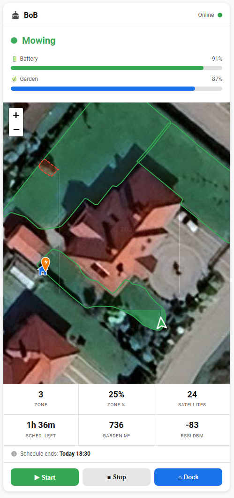

# Stiga Lawn Mower Card

[![GitHub Release][releases-shield]][releases]
[![License][license-shield]](LICENSE)
[![hacs][hacsbadge]][hacs]

Custom Lovelace card for the [Stiga Lawn Mower](https://github.com/TanerCRB/Stiga_Lawn_Mower) Home Assistant integration.

Shows live mowing status, satellite map with robot position, zone/corridor/obstacle polygons, zone progress gradient, mowing trail, schedule info, configurable stats grid, and action buttons — all in one card.



---

## Requirements

The [Stiga Lawn Mower integration](https://github.com/TanerCRB/Stiga_Lawn_Mower) must be installed and configured first.

---

## Installation

### Via HACS (Recommended)

1. Install [HACS](https://hacs.xyz/) if you haven't already.
2. In HACS, go to **Frontend** → click the **⋮ menu** (top-right) → **Custom repositories**.
3. Add this repository URL and select category **Lovelace**:
   ```
   https://github.com/TanerCRB/stiga-lawn-mower-card
   ```
4. Click **Download** on the **Stiga Lawn Mower Card** entry.
5. Reload your browser (**Ctrl+F5**).

HACS automatically registers the card as a Lovelace resource — no manual resource registration needed.

### Manual

1. Download `stiga-robot-card.js` from the [latest release](https://github.com/TanerCRB/stiga-lawn-mower-card/releases/latest).
2. Copy it to `<HA config>/www/stiga-robot-card.js`.
3. Go to **Settings → Dashboards → ⋮ → Resources** → **Add resource**:
   - URL: `/local/stiga-robot-card.js`
   - Type: **JavaScript module**
4. Press **Ctrl+F5** to hard-reload the browser.

---

## Card configuration

```yaml
type: custom:stiga-robot-card
entity_prefix: bob        # required — robot name from STIGA app, lowercase
```

### All options

```yaml
type: custom:stiga-robot-card
entity_prefix: bob              # required — robot name from STIGA app, lowercase
columns: 8                      # optional — card width in grid columns (2–12)
map_height: 200                 # optional — map height in px (default: 280)
show_map: false                 # optional — hide the satellite map (default: true)
show_progress: false            # optional — hide battery & garden bars (default: true)
show_stats: false               # optional — hide stats grid (default: true)
show_buttons: false             # optional — hide action buttons (default: true)
dock_offset_lat_m: 1.23        # optional — dock offset north from RTK antenna (metres) ← recommended
dock_offset_lon_m: -0.87       # optional — dock offset east from RTK antenna (metres)  ← recommended
dock_lat: 54.131500             # optional — dock latitude (fallback if offsets not set)
dock_lon: 16.281700             # optional — dock longitude (fallback if offsets not set)
dock_label: My Dock             # optional — charging station tooltip (default: "Charging Dock")
stats:                          # optional — customise the stats grid (see Stats Grid below)
  - zone
  - speed
  - battery
  - schedule
  - area
  - rssi
```

| Option | Type | Default | Description |
|---|---|---|---|
| `entity_prefix` | string | — | **Required.** Robot name from the STIGA app (lowercase, spaces → underscores) |
| `columns` | number | full width | Card width in grid columns (2–12). Only works in the HA Sections dashboard (2024.3+). |
| `map_height` | number | `280` | Map section height in pixels |
| `show_map` | boolean | `true` | Show/hide the satellite map |
| `show_progress` | boolean | `true` | Show/hide battery and garden progress bars |
| `show_stats` | boolean | `true` | Show/hide the stats grid |
| `show_buttons` | boolean | `true` | Show/hide Start / Stop / Dock buttons |
| `stats` | list | see below | Which metrics to show in the stats grid and in what order |
| `dock_offset_lat_m` | number | — | Dock position: metres north (+) / south (−) from the RTK antenna. Read `offset_lat_m` from device tracker attributes while robot is docked. Takes priority over `dock_lat`. |
| `dock_offset_lon_m` | number | — | Dock position: metres east (+) / west (−) from the RTK antenna. Read `offset_lon_m` from device tracker attributes while robot is docked. Takes priority over `dock_lon`. |
| `dock_lat` | number | — | Dock latitude — absolute GPS fallback when offsets are not configured |
| `dock_lon` | number | — | Dock longitude — absolute GPS fallback when offsets are not configured |
| `dock_label` | string | `Charging Dock` | Tooltip for the charging dock marker |

---

## Stats Grid

The bottom stats grid shows 6 cells by default (3 × 2). Add a `stats:` list to choose any combination or order from the 20 available metrics:

```yaml
stats:
  - zone        # current mowing zone number
  - zone_pct    # zone completion %
  - satellites  # GPS satellites in view
  - schedule    # minutes remaining in schedule window
  - area        # garden area m²
  - rssi        # cellular RSSI dBm
```

Any number of cells is supported — the grid always uses 3 columns. Omit `stats:` entirely to keep the default layout.

### All available stat keys

| Key | Label | Notes |
|---|---|---|
| `zone` | Zone | Current mowing zone number |
| `zone_pct` | Zone % | Completion within the active zone |
| `garden_pct` | Garden % | Total garden completion |
| `satellites` | Satellites | GPS satellites in view |
| `schedule` | Sched. Left | Minutes left in the active schedule window |
| `area` | Garden m² | Total garden area |
| `rssi` | RSSI dBm | Cellular signal strength |
| `rsrp` | RSRP dBm | LTE reference signal received power |
| `rsrq` | RSRQ dB | LTE reference signal received quality |
| `signal` | Signal % | Signal quality percentage |
| `battery` | Battery | Battery level % |
| `battery_cap` | Batt. mAh | Battery capacity |
| `battery_v` | Batt. mV | Battery voltage — populated during charging only |
| `battery_temp` | Batt. °C | Battery temperature — populated during charging only |
| `speed` | Speed m/s | Robot movement speed derived from RTK position |
| `rtk` | RTK Quality | RTK positioning quality |
| `coverage` | GPS Coverage | GPS coverage index |
| `work_time` | Work Hours | Cumulative mowing hours |
| `obstacles` | Obstacles | Number of mapped obstacles |
| `zones_count` | Zones | Number of mowing zones |

---

### Setting dock position (recommended method)

While the robot is **docked**, go to **Developer Tools → States**, find `device_tracker.<prefix>_location` and copy the `offset_lat_m` and `offset_lon_m` attribute values. Use them directly:

```yaml
dock_offset_lat_m: 1.234    # value from offset_lat_m attribute
dock_offset_lon_m: -0.873   # value from offset_lon_m attribute
```

The card computes the dock marker position as `RTK antenna + offset`, so the marker will land exactly where the robot stood when docked.

### Finding your `entity_prefix`

1. Go to **Developer Tools → States**.
2. Filter by `_status`.
3. Find `sensor.<something>_status` matching your robot — the `<something>` part is your prefix.

> Example: `sensor.bob_status` → `entity_prefix: bob`

### Entity overrides

If HA renamed any entity, override it individually:

```yaml
type: custom:stiga-robot-card
entity_prefix: bob
tracker: device_tracker.my_custom_tracker_name
lawn_mower: lawn_mower.garden_robot
```

---

## Features

| Feature | Notes |
|---|---|
| **Status badge** | Color-coded label (green/blue/yellow/red/purple); pulses when mowing or in error |
| **Battery bar** | Green → yellow → red as charge drops; shows % |
| **Garden progress** | Blue bar showing garden completion % |
| **Live satellite map** | Google hybrid imagery via Leaflet.js |
| **Robot marker** | Arrow pointing in direction of travel; color matches status |
| **RTK antenna marker** | Blue house icon at the RTK antenna's GPS position (auto-detected) |
| **Charging dock marker** | Orange pin — shown when `dock_lat`/`dock_lon` are set |
| **Zone polygons** | Green filled polygons for each mowing zone |
| **Zone progress gradient** | Active zone fills bottom-to-top showing % of zone already mowed |
| **Corridor polygons** | Blue dashed polygons for passages between zones (from STIGA.GO) |
| **Obstacle polygons** | Red dashed polygons for mapped obstacles |
| **Mowing trail** | Dark-green polyline tracing the robot's path this session; cleared when idle |
| **Next schedule window** | "Next mowing: Wednesday 08:00 – 10:30" from the calendar entity |
| **Stats grid** | Configurable — default: Zone, Zone %, Satellites, Schedule remaining, Garden m², RSSI |
| **Action buttons** | Start / Stop / Dock |

---

## Troubleshooting

### "Custom element doesn't exist: stiga-robot-card"

- Verify the resource is registered (HACS does this automatically; for manual install check Settings → Dashboards → Resources).
- Press **Ctrl+F5** to force a hard browser reload.

### Map shows "Loading map…" forever

The Leaflet library is loaded from `unpkg.com` — check that your HA host has outbound internet access.

### Map shows no robot position

The device tracker has no GPS fix yet. Check that the Stiga integration is connected (Cloud Connection binary sensor = On) and that RTK reference coordinates were detected (see integration README).

### Zone gradient not visible

Requires the robot to have an active zone (`sensor.<prefix>_zone`) and a valid zone completion percentage (`sensor.<prefix>_zone_completed`). Both must be numeric, not `unknown`.

---

[releases-shield]: https://img.shields.io/github/release/TanerCRB/stiga-lawn-mower-card.svg?style=for-the-badge
[releases]: https://github.com/TanerCRB/stiga-lawn-mower-card/releases
[license-shield]: https://img.shields.io/github/license/TanerCRB/stiga-lawn-mower-card.svg?style=for-the-badge
[hacs]: https://github.com/hacs/integration
[hacsbadge]: https://img.shields.io/badge/HACS-Custom-orange.svg?style=for-the-badge
